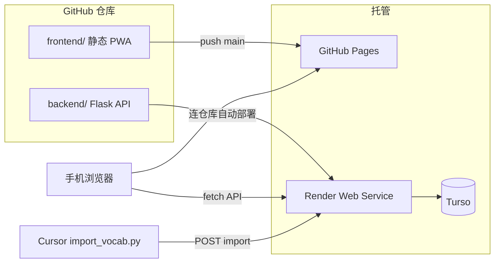

# 英文词汇轻量 PWA 实施方案

> 独立项目规划文档。目标：Flask API（Render）+ 静态 PWA 前端（GitHub Pages），支持词汇/短语/原句录入、按日期与标签浏览、复制/朗读、Anki CSV 导出。

## 已确认决策

| 项 | 决定 |
| -- | ---- |
| GitHub 仓库 | **Public** — `https://github.com/seanzombias/vocab_pwa` |
| Render 服务名 | **vocab-pwa-api** → `https://vocab-pwa-api.onrender.com` |
| 生产数据库 | **Turso**（免费档，云端 SQLite，数据持久） |
| 前端托管 | GitHub Pages → `https://seanzombias.github.io/vocab_pwa/` |

## 待办

- [ ] 创建 `backend/` 与 `frontend/` 目录结构、config、Turso/SQLite db 层与 `.env.example`
- [ ] 实现 Flask REST API（CRUD、import、anki 导出、token 鉴权、CORS）
- [ ] 实现移动优先 PWA 前端（今日/浏览/添加 Tab、复制、朗读、manifest+sw）
- [ ] 编写 `import_vocab.py` CLI 与 `sample_import.json` 示例
- [ ] 配置 Render 部署（`render.yaml`）与 GitHub Pages 发布（`.github/workflows/pages.yml`）

## 目标与约束

- **独立项目**：与 `situation_understand` 无关，单独仓库、单独部署。
- **访问方式**：
  - 前端 PWA：`https://seanzombias.github.io/vocab_pwa/`（GitHub Pages，Public 仓库）
  - 后端 API：`https://vocab-pwa-api.onrender.com`（Render 服务名 **vocab-pwa-api**）
- **录入方式**：网页表单 + Cursor 批量 JSON 导入（两者并存）。
- **依赖**：`Flask>=3.0.0`、`flask-cors`、`gunicorn`（Render 用）、`python-dotenv`、`libsql-client`（Turso）；不引入 ORM。

## 部署架构



| 层级 | 托管 | 触发方式 | 地址示例 |
| ---- | ---- | -------- | -------- |
| 前端 PWA | GitHub Pages | push `main` 或 GitHub Actions | `https://seanzombias.github.io/vocab_pwa/` |
| 后端 API | Render | 连 GitHub 仓库，push 自动部署 | `https://vocab-pwa-api.onrender.com` |
| 数据库 | Turso | 独立云服务 | `libsql://...`（Render 通过 env 连接） |

**为何前后端分离：** GitHub Pages 只能托管静态文件，Flask 必须部署在 Render 等 PaaS。

## 数据模型

每条记录字段：

| 字段 | 说明 |
| ---- | ---- |
| `id` | UUID |
| `word` | 关键词汇（必填） |
| `phrase` | 短语/搭配（可选） |
| `meaning` | 中文释义，英语场景说明（必填） |
| `sentence` | 原句/例句（必填） |
| `source` | 来源，如文章标题或 URL |
| `tags` | 字符串数组，如 `["politics","句式"]` |
| `created_at` | ISO8601 日期时间 |

**存储：**

- **本地开发**：`backend/data/vocab.db`（本地 SQLite 文件，无需 Turso 账号）
- **Render 生产**：[Turso](https://turso.tech) 云端 SQLite（已确认）
  - 免费档：约 9GB 存储、500 万行读取/月，个人词汇本足够
  - Render 实例重启或重新部署 **不会丢数据**
  - 后端通过 `libsql` / `TURSO_DATABASE_URL` + `TURSO_AUTH_TOKEN` 连接

## 目录结构

```
vocab_pwa/
  PLAN.md
  README.md
  backend/
    app.py                 # Flask 入口（仅 API，不 serve 静态页）
    config.py              # 端口、Token、CORS、DB 路径
    db.py                  # 本地 SQLite；生产连 Turso
    .env.example
    requirements.txt
    render.yaml            # Render 部署声明
    data/
      vocab.db             # 本地运行时生成
      sample_import.json
  frontend/
    index.html
    app.js                 # API_BASE 指向 Render
    config.js              # 环境：local / production API 地址
    styles.css
    manifest.webmanifest   # start_url 含 /vocab_pwa/ 子路径
    sw.js
    icons/
  scripts/
    import_vocab.py        # 默认 POST 到 Render API
  .github/
    workflows/
      pages.yml            # 构建并发布 frontend/ 到 GitHub Pages
```

## API 设计（精简 REST）

Base URL：`https://vocab-pwa-api.onrender.com`（生产） / `http://localhost:8765`（本地）

| 方法 | 路径 | 说明 |
| ---- | ---- | ---- |
| GET | `/api/vocab` | 查询；参数 `date`, `tag`, `today=1`, `q` |
| GET | `/api/vocab/tags` | 所有标签及计数 |
| GET | `/api/vocab/dates` | 有记录的日期列表 |
| POST | `/api/vocab` | 新增单条（需 Bearer token） |
| POST | `/api/vocab/import` | 批量 JSON 导入（需 token） |
| DELETE | `/api/vocab/<id>` | 删除（需 token） |
| GET | `/api/export/anki.csv` | 导出 CSV |

**CORS：** 后端允许以下来源：

- `https://seanzombias.github.io`
- `http://localhost:*`（本地调试）

环境变量 `ALLOWED_ORIGINS` 逗号分隔配置。

**Anki CSV 格式**（UTF-8 BOM）：

```csv
Front,Back,Tags
defuse,"化解民粹反抗\n\n短语: defuse a populist revolt\n\n原句: anxious to defuse a populist revolt\n\n来源: Axios",politics verb
```

## 前端 PWA 功能

`frontend/index.html` 单页，三个 Tab：

1. **今日** — `GET {API_BASE}/api/vocab?today=1`
2. **浏览** — 日期 / 标签筛选 + 搜索
3. **添加** — 表单 POST 到 Render API（token 存 `localStorage`）

**GitHub Pages 子路径注意：**

- 仓库名 `vocab_pwa` → 站点根路径为 `/vocab_pwa/`
- `manifest.webmanifest` 的 `start_url`、`scope` 设为 `/vocab_pwa/`
- `sw.js` 注册路径：`/vocab_pwa/sw.js`
- `config.js` 中 `API_BASE` 指向 Render 完整 URL（非相对路径）

**交互：**

- **一键复制**：复制 word + phrase + meaning + sentence
- **朗读**：`speechSynthesis` 朗读 word + sentence
- **导出 Anki**：`window.open(\`${API_BASE}/api/export/anki.csv?...\`)`
- **PWA 安装**：GitHub Pages 自带 HTTPS，可「添加到主屏幕」

## Cursor 批量导入工作流

1. 按 `backend/data/sample_import.json` 格式整理 JSON。
2. 执行（指向 Render 或本地）：

```bash
# 生产：写入 Render 后端
python scripts/import_vocab.py backend/data/today.json --api https://vocab-pwa-api.onrender.com

# 本地
python scripts/import_vocab.py backend/data/today.json --local
```

## 云部署步骤

### 1. GitHub 仓库（Public）

1. 在 [github.com/seanzombias](https://github.com/seanzombias) 创建 **Public** 仓库 `vocab_pwa`
2. 推送代码：

```bash
git remote add origin https://github.com/seanzombias/vocab_pwa.git
git push -u origin main
```

3. 仓库 **Settings → Pages → Build and deployment → Source** 选 **GitHub Actions**

Public 仓库可使用 GitHub Pages 免费 HTTPS 托管。

### 2. Turso 数据库

1. [turso.tech](https://turso.tech) 注册并安装 CLI（可选）
2. 创建数据库，例如：

```bash
turso db create vocab-pwa
turso db show vocab-pwa --url
turso db tokens create vocab-pwa
```

3. 记下：
   - `TURSO_DATABASE_URL`（形如 `libsql://vocab-pwa-xxx.turso.io`）
   - `TURSO_AUTH_TOKEN`

本地开发可继续用 `backend/data/vocab.db`；上线后 Render 只连 Turso。

### 3. Render 后端（服务名 vocab-pwa-api）

1. [render.com](https://render.com) → **New Web Service** → 连接 Public 仓库 `seanzombias/vocab_pwa`
2. **Name**：`vocab-pwa-api`（固定，对应 URL `https://vocab-pwa-api.onrender.com`）
3. **Root Directory**：`backend`
4. **Build Command**：`pip install -r requirements.txt`
5. **Start Command**：`gunicorn app:app --bind 0.0.0.0:$PORT`
6. **Environment Variables**：

| 变量 | 说明 |
| ---- | ---- |
| `VOCAB_API_TOKEN` | 写操作鉴权，随机长字符串 |
| `SECRET_KEY` | Flask 密钥 |
| `ALLOWED_ORIGINS` | `https://seanzombias.github.io` |
| `TURSO_DATABASE_URL` | Turso 数据库 URL |
| `TURSO_AUTH_TOKEN` | Turso 访问令牌 |

7. 首次部署成功后，API 根地址：`https://vocab-pwa-api.onrender.com`

### 4. 前端配置并发布

更新 `frontend/config.js`：

```javascript
export const API_BASE = "https://vocab-pwa-api.onrender.com";
```

push 到 `main` → GitHub Actions 发布 Pages → 手机访问：

`https://seanzombias.github.io/vocab_pwa/`

### 5. 手机安装 PWA

Safari / Chrome 打开上述地址 → **添加到主屏幕**。

**安全：** 写操作需 API Token；读操作默认公开。Token 仅保存在手机 `localStorage`，勿提交到仓库。

## 本地开发

**后端：**

```bash
cd backend
pip install -r requirements.txt
cp .env.example .env
python app.py   # http://localhost:8765
```

**前端：**

```bash
cd frontend
python -m http.server 8080
# config.js 中 API_BASE = "http://localhost:8765"
```

或用 Flask 临时 serve 前端（仅开发）；生产仍走 Pages + Render 分离。

## 仓库与线上地址

| 项 | 值 |
| -- | -- |
| GitHub 账户 | [seanzombias](https://github.com/seanzombias) |
| 仓库 | **Public** — [github.com/seanzombias/vocab_pwa](https://github.com/seanzombias/vocab_pwa) |
| GitHub Pages | `https://seanzombias.github.io/vocab_pwa/` |
| Render API | `https://vocab-pwa-api.onrender.com` |
| Turso DB | 库名建议 `vocab-pwa`（在 Turso 控制台创建） |
| 本地路径 | `C:\Users\Administrator\Desktop\vocab_pwa` |

## 验证清单

- [ ] Turso 建表成功，Render 连库无报错
- [ ] `https://vocab-pwa-api.onrender.com/api/vocab` 可访问
- [ ] GitHub Pages 前端可打开，无 CORS 报错
- [ ] 网页添加一条词汇，手机刷新可见
- [ ] `import_vocab.py --api ...` 批量导入 3 条成功
- [ ] 「今日」Tab 只显示当天记录
- [ ] 按标签 `politics` 筛选正确
- [ ] 复制、朗读可用
- [ ] Anki CSV 下载可导入
- [ ] 手机「添加到主屏幕」成功，PWA 可离线打开壳（静态缓存）
